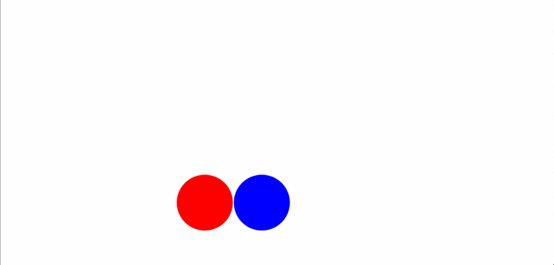

# bouncy_js
My first ever JS, that displays 2 bouncing circles.

   

## How to use

Spacebar: Pause/Unpause

M: Mute

'+': Speed up

'-': Slow down

(Note: If you press '-' a bunch, you're in for a surprise.)